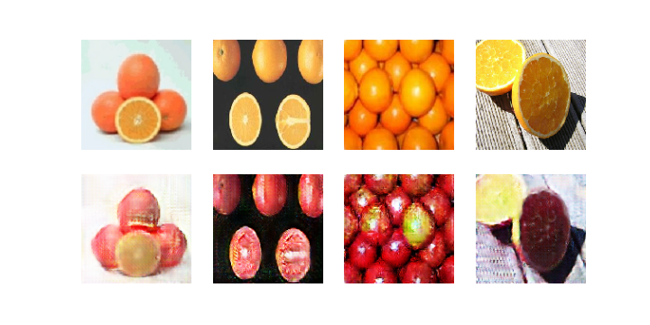

## CycleGAN - Tensorflow 2
[Paper: Unpaired Image-to-Image Translation using Cycle-Consistent Adversarial Networks](https://arxiv.org/abs/1704.00028)

The goal is to learn mapping functions between two domains X and Y given training samples. Training samples are from unpaired datasets. In such datasets there is no information provided as to which image from input domain(X) matches which image in output domain(Y). However, we assume there is some underlying relationship between the domains – for example, that they are
two different renderings of the same underlying scene – and
seek to learn that relationship.

Objective function contains two types of terms: adversarial losses (GAN Loss) for matching the distribution of generated images to the data distribution in the target domain; and cycle consistency losses to prevent the learned mappings G and F from contradicting each other. G refers to the generator which maps X to Y and F does the vice-versa.

## Tensorflow2 Implementation 

[Here](https://github.com/Mohammad-Rahmdel/CycleGAN/tree/master/CycleGAN.ipynb) is the implementation of CycleGAN paper. It is implemented in Google Colab. If you want to run it on your system you should make some changes!

Set your desired resolution of images. Also select the dataset you want. You can find the dataset choices [here](https://people.eecs.berkeley.edu/%7Etaesung_park/CycleGAN/datasets/).

apple2orange examples: 

<table align='center'>
 <tr align='center'>
<td> Epoch 1 </td>
<td> Epoch 100 </td>
</tr>
<tr align='center'>
<td> 
<td> 
</tr>
</table>

<table align='center'>
 <tr align='center'>
<td> Epoch 1 </td>
<td> Epoch 100 </td>
</tr>
<tr align='center'>
<td> 
<td> 
</tr>
</table>

## Results 

I trained the model on four different unpaired datasets.

### monet2photo
Number of trained epochs: 60   
Resolution: 256*256   

Results on dataset samples:  

 <b>
    photo to monet
 </b>

<table align='center'>	
<tr align='center'>
<td> 
<td> 
</tr>	
<tr align='center'>
<td> 
<td> 
</tr>
</table>

Results on random samples(These images are not given to the model in training time)  

    <b> photo to monet </b>

<table align='center'>	
<tr align='center'>
<td> 
<td> 
</tr>	
<tr align='center'>
<td> 
<td> 
</tr>
<tr align='center'>
<td> 
<td> 
</tr>
<tr align='center'>
<td> 
<td> 
</tr>
</table>

### vangogh2photo
Number of trained epochs: 200   
Resolution: 256*256   

dataset samples  

    <b> photo to vangogh </b>

​​  

 ​​  

 ​​  

random samples  

    <b> photo to vangogh </b>

<table align='center'>	
<tr align='center'>
<td> 
<td> 
</tr>	
<tr align='center'>
<td> 
<td> 
</tr>	
<tr align='center'>
<td> 
<td> 
</tr>	
</table>

### apple2orange
Number of trained epochs: 200  
Resolution: 128*128  

    <b> apple to orange </b>

<table align='center'>
<tr align='center'>
<td> 
<td> 
</tr>
 </table>
 
<table align='center'>

    <b> orange to apple </b>

<tr align='center'>
<td> 
<td> 
</tr>
</table>

    <b> cycled images </b>

<table align='center'>
<tr align='center'>
<td> 
</tr>
<tr align='center'>
<td> 
</tr>
</table>

### horse2zebra
Number of trained epochs: 200   
Resolution: 128*128   

​​  

​​  

 

You can find more generated samples [here](https://github.com/Mohammad-Rahmdel/CycleGAN/tree/master/results).

